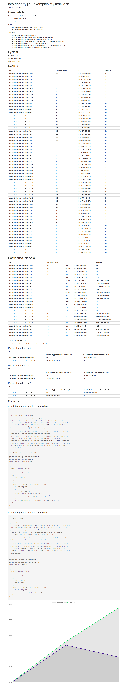

# jinu
Java algorithm evaluation framework.

Jinu is an attempt at promoting reproducible research. It allows Java developpers to easily:
* check the influence of input parameters on an algorithm
* compare different algorithms with the same input
* compare results with objective measures
* share their evaluation procedures and results


## Download
Using maven:
```
<dependency>
    <groupId>info.debatty</groupId>
    <artifactId>jinu</artifactId>
    <version>RELEASE</version>
</dependency>
```

Or check the [releases](https://github.com/tdebatty/jinu/releases).

## Quickstart

Create the case.

```
import info.debatty.jinu.Case;


public class MyTestCase extends Case {

    public static void main(final String[] args) throws Exception {
        Case test = new MyTestCase();
        test.run();
    }

    public MyTestCase() {
        super();
        
        // Test will be repeated 10 times to measure average values
        setIterations(10);
        
        // Test will be repeated with 3 different input values
        setParamValues(new double[]{2.0, 3.0, 4.0});
        
        // Test will compare two algorithms
        addTest(DummyTest.class);
        addTest(DummyTest2.class);
    }
}
```

The different tests in the case must implement the TestInterface

```
import info.debatty.jinu.TestInterface;
import java.util.Random;
import java.util.logging.Level;
import java.util.logging.Logger;

public class DummyTest implements TestInterface {

    public final double[] run(final double param) {
        /// do some stuff
        Random rand = new Random();
        return new double[]{155.0 + param * rand.nextGaussian()};
    }

}
```

JINU will run all iterations for all input values and all algorithms, and produce two documents:
* a dat file containing the results, which can be used with gnuplot or others
* a complete html report like the one below

This report will contain:
* the details of the case (name, hashtag, number of iterations, tests, classpath used etc.)
* the details of the system on which the test was run (JVM memory, number of cores, hostname)
* the results
* the statistics regarding these results (average value, standard deviation and 95% confidence interval)
* the similarity between tests (does test A produce the same average result as test B ?)
* the source code of the tests




